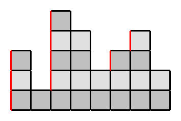

# Array

## **Notes**

*   Two/Three-way partition for an array. They are common techniques used in quicksort, Dutch national flag problem, and other array manipulation problems.

    <pre class="language-java"><code class="lang-java">// Two-way partition
    // it divides the array into 2 parts
    // elements &#x3C; pivot and >= pivot (or elements &#x3C;= pivot and >= > pivot), 
    // making it simple but inefficient for duplicate values.
    private int[] twoWaysPartition(int[] nums, int left, int right) {
        int pivot = nums[right];
        int i = left;
        for (int j = left; j &#x3C; right; j++) {
            if (nums[j] &#x3C; pivot) {
                swap(nums, i, j);
                i++;
            }
        }
        swap(nums, i, right);
        return i;
    }

    // Three-way partition (AKA Dutch National Flag Problem => LC 75)
    <strong>// it further splits the array into 3 parts
    </strong><strong>// element &#x3C; pivot, == pivot, and > pivot, 
    </strong><strong>// reducing redundant swaps and improving QuickSort efficiency, especially when duplicates are common.
    </strong>private int[] threeWayspartition(int[] nums, int left, int right) {
        int pivot = nums[right];
        int i = left;
        int j = left;
        int k = right;
        while (j &#x3C;= k) {
            if (nums[j] &#x3C; pivot) {
                swap(nums, i, j);
                i++;
                j++;
            } else if (nums[j] > pivot) {
                swap(nums, j, k);
                k--;
            } else {
                j++;
            }
        }
        return new int[]{i,k};
    }
    </code></pre>
* For an array of length n, the number of subarrays = $$1 + 2 + ... + n = n  * (n + 1) / 2$$
  * Reason: fixing right end r (from 1 to n), there are r choices for the left end

## **Typical Questions**

### **Matrix**

* :orange\_circle: LC 59. Spiral Matrix II
  * LC solution is easier than 代码随想录, There are 4 vars representing the 4 boundaries and they keep approaching the center as the traversal
* LC 54. Spiral Matrix
  * Similar as above&#x20;
  * [Optimal Answer](https://leetcode.com/problems/spiral-matrix/submissions/1495629711). TC: $$O(m*n)$$, SC: $$O(1)$$
* :orange\_circle: LC 2018. Check if Word Can Be Placed In Crossword
  * It's kind of hard to implement with a clear thought
  * [Optimal Solution](https://leetcode.com/problems/check-if-word-can-be-placed-in-crossword/submissions/1485698943)
    * Let $$m$$ be the length of rows, $$n$$ be the length of columns, $$k$$ be the length of the word
    * TC: $$O(m*n*k)$$
    * SC: $$O(1)$$
* LC 48. Rotate Image
  * It's very tricky (The second time I ran into this problem, I figured it out myself!)
  * [Optimal Answer](https://leetcode.com/problems/rotate-image/submissions/1495549248). TC: $$O(n^2)$$, SC: $$O(1)$$
* :white\_circle: LC 36. Valid Sudoku
  * It's challenging to come up with a solution with 1 pass.
  * [Optimal Answer](https://leetcode.com/problems/valid-sudoku/submissions/1782852101). TC: $$O(1)$$, SC: $$O(1)$$
* :white\_circle: LC 73. Set Matrix Zeroes
  * It's challenging to come up with a solution that uses constant space.
  * [Optimal Answer](https://leetcode.com/problems/set-matrix-zeroes/submissions/1783840794). TC: $$O(m*n)$$, SC: $$O(1)$$
* LC 289. Game of Life
  * It's challenging to come up with a solution that uses constant space. (I made it the first time I saw this problem!)
  * [Optimal Answer](https://leetcode.com/problems/game-of-life/submissions/1784560914). TC: $$O(m*n)$$, SC: $$O(1)$$
* :white\_circle: LC 498. Diagonal Traverse
  * Try to do it without a boolean variable.
  * [Optimal Answer](https://leetcode.com/problems/diagonal-traverse/submissions/1883427909). TC: $$O(m*n)$$, SC : $$O(1)$$
* :orange\_circle: LC 723. Candy Crush
  * Easy to misunderstand problem statement on when a candy can be crushed.
  * [Optimal Answer](https://leetcode.com/problems/candy-crush/submissions/1888257445). TC: $$O(m^2*n^2)$$, SC: $$O(n)$$

### **Boyer-Moore Voting Algorithm**

* :red\_circle: LC 169. Majority Element
  * I can't come up with this optimal solution without knowing/remembering this specific algorithm. This algorithm only works under the assumption that a majority element is guaranteed.
  * Remember this question is about finding the number which appears⌊n / 2⌋ times, but **NOT** the number with the highest frequency (mode).
  * [Optimal Answer](https://leetcode.com/problems/majority-element/submissions/1477353262). TC: $$O(n)$$, SC: $$O(1)$$

### Sorting Algorithm

* :star2: LC 215. Kth Largest Element in an Array
  * :orange\_circle: [Counting Sort Solution](https://leetcode.com/problems/kth-largest-element-in-an-array/submissions/1468838317).
    * TC: $$O(n+m)$$, where $$n$$ is the length of `nums` and $$m$$ is `maxValue - minValue`
    * SC: $$O(m)$$, $$m$$ is `maxValue - minValue`
  * :orange\_circle: [QuickSelect Solution](https://leetcode.com/problems/kth-largest-element-in-an-array/submissions/1558635028). TC: $$O(n)$$, SC:  $$O(1)$$
    * [Quickselect](https://en.wikipedia.org/wiki/Quickselect), also known as **Hoare's selection algorithm**, is an algorithm for finding the $$k_{th}$$ smallest element in an unordered list. It is significant because it has an **average** runtime of $$O(n)$$.
    * Using the two-way partition in QuickSelect will cause TLE due to too many duplicates in some test cases, so use the three-way partition instead.
  * [MinHeap Solution](https://leetcode.com/problems/kth-largest-element-in-an-array/submissions/1468831794). TC: $$O(n*log{k})$$, SC: $$O(k)$$
* LC 274. H-Index
  * We scan citation counts from highest to lowest and keep a running total of how many papers have at least that many citations. The H-index is the first value 𝑐 for which the accumulated paper count is greater than or equal to 𝑐.
  * Approach 1 with normal sorting: [Answer](https://leetcode.com/problems/h-index/submissions/1766592357).  TC: $$O(n*logn)$$, SC: $$O(n)$$
  * :thumbsup: :red\_circle: Approach 2 with Counting Sort: [Optimal Answer](https://leetcode.com/problems/h-index/submissions/1855709734). TC: $$O(n)$$, SC: $$O(n)$$
    * It's tough to understand...
    * 2 ideas by scanning citation counts (`c`) from highest to lowest and keep a running total of how many papers (`papers`) have at least that many citations
      * :x: 1. Use `papers`:  Find the last `papers` which `papers` < c. This can be a result candidate, but may not be the best result. For example, if the input is \[3, 2, 2], this idea will return 1 as a result, but the real result is 2.
      * :white\_check\_mark: 2. Use `c`:  Find the first `c` which `papers` ≥ `c`. C-based method works because `c` is exactly the value that must satisfy the H-index definition. `papers` is only used to verify it, not to produce the H-index value.

### **DNF algorithm**

* :orange\_circle: LC 75. Sort Colors
  * **DNF algorithm (Dutch national flag problem)**. Read the detailed explanation of the optimal solution
  * Update: Move this question from Two Pointers section to Array section because I find it relates to the Three-way partition used in the QuickSelect algorithm.
  * [Optimal Solution](https://leetcode.com/problems/sort-colors/submissions/1485004939). TC: $$O(n)$$, SC: $$O(1)$$

### **Other Array Questions**

* LC 1431. Kids With the Greatest Number of Candies
*   :orange\_circle: LC 1526. Minimum Number of Increments on Subarrays to Form a Target Array

    * After thinking array as a list of height values, it's easy to resolve.
    * [Optimal Answer](https://leetcode.com/problems/minimum-number-of-increments-on-subarrays-to-form-a-target-array/submissions/1474827964). TC: $$O(n)$$, SC: $$O(1)$$

    <figure><figcaption></figcaption></figure>
* :white\_circle: LC 189. Rotate Array
  * Be careful for the corner case (what if k is very large).
  * [Optimal Answer](https://leetcode.com/problems/rotate-array/submissions/1486719102). TC: $$O(n)$$, SC: $$O(1)$$
* :orange\_circle: LC 41. First Missing Positive
  * It's hard to resolve it in TC $$O(n)$$, SC: $$O(1)$$. The key idea is to reuse the original array as a map.
  * [Optimal Answer](https://leetcode.com/problems/first-missing-positive/submissions/1494537924)
    * TC: $$O(n)$$, **the inner `while` loop across all iterations of the outer loop is O(n).**
    * SC: $$O(1)$$
* LC 485. Max Consecutive Ones
  * [Optimal Answer](https://leetcode.com/problems/max-consecutive-ones/submissions/1542263025). TC:  $$O(n)$$, SC: $$O(n)$$
* LC 3151. Special Array I
  * [Optimal Answer](https://leetcode.com/problems/special-array-i/submissions/1555641292). TC: $$O(n)$$, SC: $$O(1)$$
* :white\_circle: LC 251. Flatten 2D Vector
  * [Optimal Answer](https://leetcode.com/problems/flatten-2d-vector/submissions/1597923049).
    * Let $$N$$ be the number of integers and $$V$$ be the number of cells (some could be empty) of the input
    * TC:
      * Constructor: $$O(1)$$
      * `next()`, `hasNext()` : $$O(V/N)$$
    * SC: $$O(1)$$
* LC 3201. Find the Maximum Length of Valid Subsequence I
  * [Optimal answer](https://leetcode.com/problems/find-the-maximum-length-of-valid-subsequence-i/submissions). TC: $$O(n)$$, SC: $$O(1)$$
* :red\_circle: LC 3480. Maximize Subarrays After Removing One Conflicting Pair
  * This is too hard. No idea or even a clue at all.
  * Check this [solution](https://leetcode.com/problems/maximize-subarrays-after-removing-one-conflicting-pair/solutions/7005474/maximize-subarrays-a-single-pass-on-solu-11eq) to understand it.
  * [Optimal Answer](https://leetcode.com/problems/maximize-subarrays-after-removing-one-conflicting-pair/submissions/1890596485).&#x20;
    * Let $$N$$ be the input integer and $$P$$ be the number of conflicting pairs.
    * TC: $$O(N+P)$$, SC: $$O(N)$$
* LC 1762. Buildings With an Ocean View
  * [Optimal Answer](https://leetcode.com/problems/buildings-with-an-ocean-view/submissions/1898289650). TC: $$O(N)$$, SC: $$O(N)$$

### Simulation

* :white\_circle: LC 755. Pour Water
  * [Optimal Answer](https://leetcode.com/problems/pour-water/submissions/1606047834). TC: $$O(n*v)$$, SC: $$O(1)$$
