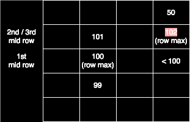

# Binary Search

## **Notes**

* Binary search is essentially an application of the divide-and-conquer paradigm. This algo is useful when resolving questions like
  * Search item in an ordered array
  * Sqrt related question
* Use **close-close range \[l,r] to check array**, the `while` loop condition should be **`while(l<=r)`** because \[l,r] is a valid range.
  * If you want to **memorize it mechanically**, this `while` loop condition applies to **classic binary search** or **finding the first or last occurrence**.
* Remember to use `long` if necessary

```java
// WRONG code
// mid is an int, so the expression mid * mid is evaluated using integer arithmetic. This means the result of mid * mid is an int.
// If mid * mid exceeds the maximum value of int (2^31 - 1), it will still overflow before being assigned to midSquare.
int mid  = ...;
long midSquare = mid * mid;

// CORRECT code
int mid  = ...;
long midSquare = (long)mid * mid;
```

* If the question also wants you to return the **closest item on the right/left side of the target** when there is no exact match, check if you want to use `l` or `r` directly instead of doing other unnecessary steps.
  * If there is no exact match, at the (end - 1) round in `while` loop, `l` and `r` should point to the same element `item_x`. Then,
    * If `item_x` is larger than the target, `l` will be the index of `item_x` - 1
    * If `item_x` is smaller than the target, `r` will be the index of `item_x` + 1
* For binary search in a 2D matrix, check if it can be treated as a 1D array, for how to convert the index in 1D (`[index])` to index in the 2D matrix (`[rowIndex][colIndex]`)
  * row index: `rowIndex = index / colNum`&#x20;
  * col index: `colIndex = index % colNum`
*   Find **lower-bound (1st item >= target. Also for finding the first occurrence)** in a sorted array with **dup** items. Find **upper-bound (last item <= target. Also for finding the last occurrence).**

    <pre class="language-java" data-line-numbers data-full-width="false"><code class="lang-java">private int lowerboundBinarySearch(int[] array, long target) {
      int l = 0;
      int r = array.length-1;
      if (array[r] &#x3C; target) {
          return -1;
      }
      while (l &#x3C;= r) {
          int mid = l + (r-l)/2;
          if (array[mid] >= target) {
              r = mid-1;
          } else {
              l = mid+1;
          }
      }
      return l;
    }
    // Case 1:
    //   >=target  >=target
    //   a[i]      a[i+1]
    //   l(mid)       r
    //   next rounds: r will be l => r = l-1 => exit loop
    // Case 2:
    //   &#x3C;target  >=target
    //   a[i]      a[i+1]
    //   l(mid)       r
    //   next rounds: l will be r => r = l-1 => exit loop
    // Case 3:
    //    &#x3C;>: does not matter
    //    &#x3C;>       >=target  >=target
    //   a[i]      a[i+1]    a[i+2]
    //     l        mid         r
    //   next rounds: r will be l => r = l-1 => exit loop
    // Case 4:
    //   &#x3C;target   &#x3C;target   >=target
    //   a[i]      a[i+1]    a[i+2]
    //     l        mid         r
    //   next rounds: l will be r => r = l-1 => exit loop

    private int upperboundBinarySearch(int[] array, long target) {
      int l = 0;
      int r = array.length-1;
      if (array[l] > target) {
          return -1;
      }
      while (l &#x3C;= r) {
          int mid = l + (r-l)/2;
          if (array[mid] &#x3C;= target) {
              l = mid+1;
          } else {
              r = mid-1;
          }
      }
      return r;
    }
    </code></pre>

## **Typical Questions (16)**

### **Classic Binary Search (4)**

* :star2: LC 704. Binary Search
* LC 374. Guess Number Higher or Lower
  * [Optimal Answer](https://leetcode.com/problems/guess-number-higher-or-lower/submissions/1469549261). TC: $$O(log{n})$$, SC: $$O(1)$$
* LC 35. Search Insert Position&#x20;
  * Also need to take care of the closest item to the target

```java
  // If no target, at the (end - 1) round, the binary search will look like
  //    l, r
  //   mid 
  // if target < mid, then in the end, r = mid-1, l=mid
  // if mid < target, then in the end, r = mid, l=mid+1
  // The l value always satisfies the requirement at the end.
```

* LC 74. Search a 2D Matrix
  * Approach 1: Do a binary search for rows first and then for columns.
  * Approach 2: Treat 2D matric as a 1D array and then do a binary search.
    * [Optimal Answer](https://leetcode.com/problems/search-a-2d-matrix/submissions/1497798125). TC: $$O(log{m*n})$$, SC: $$O(1)$$

### **Binary Search for Bounds (5)**

* :orange\_circle: LC 2300. Successful Pairs of Spells and Potions
  * [Optimal Answer](https://leetcode.com/problems/successful-pairs-of-spells-and-potions/submissions/1469573008)
    * $$n$$ is the number of elements in the `spells` array, and $$m$$ is the number of elements in the `potions` array.
    * TC: $$O((m+n)*log{m})$$
    * SC: $$O(m)$$,
* LC 875. Koko Eating Bananas
  * After knowing the brute force solution, you can realize it is related to binary search
  * [Optimal Answer](https://leetcode.com/problems/koko-eating-bananas/submissions/1469787302)
    * Let $$n$$ be the length of the input array piles and $$m$$ be the maximum number of bananas in a single pile from piles.
    * TC: $$O(n*log{m})$$
    * SC: $$O(1)$$
* :white\_circle: LC 1011. Capacity To Ship Packages Within D Days
  * It's very similar to LC 875
  * [Optimal Solution](https://leetcode.com/problems/capacity-to-ship-packages-within-d-days/submissions/1493694939). TC: $$O(n*log{n})$$, SC: $$O(1)$$
* :orange\_circle: LC 410. Split Array Largest Sum
  * The optimal solution is the same as LC 1011, but I did not realize it when I first saw this question.
  * There is another suboptimal solution using dynamic programming. It's a classic DP approach and worth reading as well.
* :white\_circle: LC 34. Find First and Last Position of Element in Sorted Array
  * Multiple-round binary search after finding the target
  * The left or right pointer we pay attention to may skip the result in the middle, but another pointer will point to the result index if it exists.
* :white\_circle: LC 69. Sqrt(x)
  * Avoid overflow using `long`
  * Be careful about making code concise enough when returning the closest item of the target if there is no match.
  * [Optimal Answer](https://leetcode.com/problems/sqrtx/submissions/1496896428). TC: $$O(logn)$$, SC: $$O(1)$$
* :orange\_circle: LC 3733. Minimum Time to Complete All Deliveries
  * [Optimal Answer](https://leetcode.com/problems/minimum-time-to-complete-all-deliveries/submissions/1937513167). TC: $$O(log_2(d0*r0+d1*r1))$$, SC: $$O(1)$$

### **Peak Finding (2)**

* Notes
  * Reference for MIT course: [https://www.youtube.com/watch?v=HtSuA80QTyo](https://www.youtube.com/watch?v=HtSuA80QTyo)
* :star2: :white\_circle: LC 162. Find Peak Element
  * Use **binary search** to find a random local max
  * Given the question description, the answer must exist. So when `l==r`, it must be a valid answer.
  * Always go up a slope (cut off the lower half). We may miss some peaks, but it does not matter because we can always at least find 1 peak in our selected peak.
  * **Only compare mid with the right side of it: `nums[mid] < nums[mid+1]`** because
    * &#x20;`mid+1` will never be out of the index based on how we get mid `l+(r-l)/2`. But `mid-1` may be out of index and needs other special handling.&#x20;
    * For the corner case with a single element, it will not go into `while` loop with the condition `l < r`&#x20;
  * \[**Not Recommended**] If you really want to compare `mid` with `mid-1`, you need to modify `while` condition, `return` statement, and other places. Check this [Alternative Answer](https://leetcode.com/problems/find-peak-element/submissions/1479973904)
  * [Optimal Answer](https://leetcode.com/problems/find-peak-element/submissions/1469671148). TC: $$O(log{n})$$, SC: $$O(1)$$
* :red\_circle: LC 1901. Find a Peak Element II
  * It's very hard. It utilizes the **transitivity of maximum** values **across** rows and columns.
  *   [Optimal Answer](https://leetcode.com/problems/find-a-peak-element-ii/submissions/1469772565)

      * Let $$n$$ be the size of rows and $$m$$ be the size of columns.
      * TC: $$O(m*log{n})$$
      * SC: $$O(1)$$

      <div align="left"><figure><figcaption></figcaption></figure></div>

### Rotated Sorted Array (2)

* Notes
  * The idea of searching in a rotated sorted array is similar to peak finding, but in a reversed way: instead of finding a peak, we are finding a bottom (minimum). The key difference is that not just any bottom works — we must find **the specific bottom where the rotation happens**.
* :orange\_circle: LC 153. Find Minimum in Rotated Sorted Array
  * It's the foundation of the next LC 33 question.
  * [Optimal Answer](https://leetcode.com/problems/find-minimum-in-rotated-sorted-array/submissions/1870590059). TC: $$O(log{n})$$, SC: $$O(1)$$
* :red\_circle: LC 33. Search in Rotated Sorted Array
  * Very hard to get ideas and very easy to make mistakes during implementation
  * Approach 1 using 3 binary searches: 1 binary search to find pivot (idea is similar to peak finding). Then use 2 binary searches on 2 parts split by the pivot.
    * [Answer](https://leetcode.com/problems/search-in-rotated-sorted-array/submissions/1870527658). TC: $$O(log{n})$$, SC: $$O(1)$$
  * :thumbsup: Approach 2 using 1 pass binary search: [Optimal Answer](https://leetcode.com/problems/search-in-rotated-sorted-array/submissions/1482683943). TC: $$O(log{n})$$, SC: $$O(1)$$

### **2 Arrays Binary Search (1)**

* :star2: :red\_circle: LC 4. Median of Two Sorted Arrays
  * It's super complicated. Check ideas in comments of optimal answer.
  * [Optimal Answer](https://leetcode.com/problems/median-of-two-sorted-arrays/submissions/1476824975). TC: $$O(log({min(m,n)}))$$, SC: $$O(1)$$
  * References
    * [https://www.bilibili.com/video/BV1Xv411z76J](https://www.bilibili.com/video/BV1Xv411z76J)
    * [https://www.bilibili.com/video/BV1H5411c7oC](https://www.bilibili.com/video/BV1H5411c7oC)
  * **Update: Better check the LeetCode editorial solution. It's clearer!**

### Other Binary Search Problems (3)

* LC 540. Single Element in a Sorted Array
  * [Optimal Answer](https://leetcode.com/problems/single-element-in-a-sorted-array/submissions/1493037105). TC: $$O(n)$$, SC: $$O(1)$$
* LC 3453. Separate Squares I
  * [Optimal Answer](https://leetcode.com/problems/separate-squares-i/submissions/1550351034).  TC: $$O(n*log_2{BoundaryY})$$, SC: $$O(1)$$
