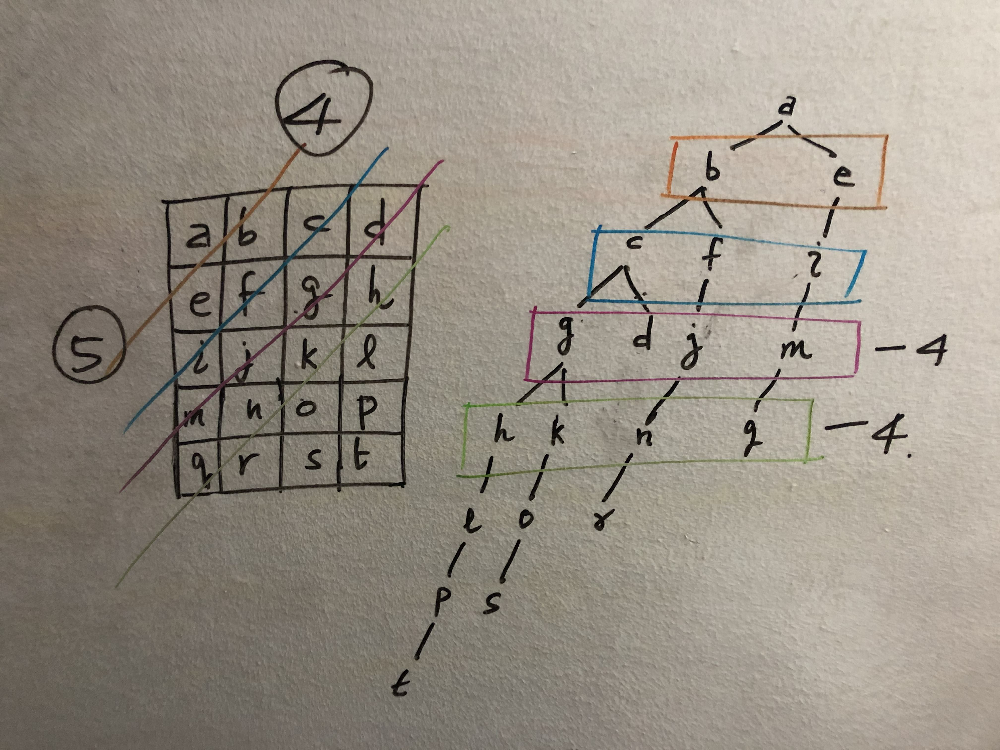
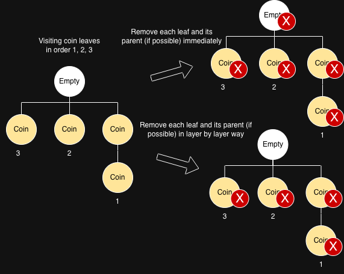

# Graph

## **Notes**

* Most DFS questions can also be resolved by BFS.
* **BFS** is useful when finding the **shortest path** to a position.
* Find Shortest Path
  * **Unweighted** graph: BFS
  * **Non-negative weighted** graph: Dijkstra's algorithm, which relies on the greedy algorithm

## **Typical Questions**

### **DFS**

* Notes
  * 2 Implementation approach: `Stack` and Recursion
* :star2: LC 841. Keys and Rooms
  * [Stack Answer](https://leetcode.com/problems/keys-and-rooms/submissions/1466862927).
    * TC: $$O(N+E)$$, where N is the number of rooms, and E is the total number of keys.
    * SC: $$O(N)$$, store stack and visited array.
  * [Recursion Answer](https://leetcode.com/problems/keys-and-rooms/submissions/1466866415)
    * TC: $$O(N+E)$$, where N is the number of rooms, and E is the total number of keys.
    * SC: $$O(N)$$, store visited array. In the worst case, the recursion depth can go up to $$N$$
* :star2: LC 547. Number of Provinces
  * [Stack Answer](https://leetcode.com/problems/number-of-provinces/submissions/1466897399). TC: $$O(n^2)$$, SC: $$O(n)$$
  * [Recursion Answer](https://leetcode.com/problems/number-of-provinces/submissions/1466898390). TC: $$O(n^2)$$, SC: $$O(n)$$
* :red\_circle: LC 1466. Reorder Routes to Make All Paths Lead to the City Zero
  * Key points
    * Input has n node, n-1 edges, and only 1 edge between 2 nodes. Therefore there must be no circle and it looks like a tree.
    * To resolve this issue, we can first double the edge between every 2 nodes by adding 1 "artificial edge" so every node is reachable by an "artificial" or "original" edge. Then we can do DFS from node '0' and count the number of "original edges" during traversal. See detailed explanation in LC editorial.
  * [Optimal Answer](https://leetcode.com/problems/reorder-routes-to-make-all-paths-lead-to-the-city-zero/submissions/1467707047)
    * TC: $$O(n)$$, both adjacency map initialization and DFS are $$O(n)$$
    * SC: $$O(n)$$.
      * Adjacency list takes $$O(n)$$ space. It has $$n$$ keys and $$2*(n-1)$$ values
      * The recursion call stack used by DFS can have no more than n elements in the worst-case scenario. It would take up to $$O(n)$$ space in that case.
* :white\_circle: LC 399. Evaluate Division
  * Resolved by myself but it's easy to make some mistakes during implementation and I polished the answer a bit based on the editorial
  * [Optimal Answer](https://leetcode.com/problems/evaluate-division/submissions/1467769378).
    * TC: $$O(M*N)$$, where $$N$$ is the number of input equations and $$M$$ is the number of queries.
    * SC: $$O(N)$$
* :white\_circle: LC 130. Surrounded Regions
  * I made it the first time I met this problem!
  * Both BFS (multi-source) and DFS can solve this problem.
  * [Optimal Answer](https://leetcode.com/problems/surrounded-regions/submissions/1863659467). TC: $$O(m*n)$$, SC: $$O(m*n)$$. In DFS, the recursion stack depth is at most `m × n` because DFS only explores one path at a time. It does not push all four directions simultaneously; instead, it follows a single direction as deep as possible before backtracking. In a grid, this single path can visit every cell once, leading to a maximum recursion depth of `O(m*n)`.
* LC 133. Clone Graph
  * Both BFS and DFS can solve this problem
  * [DFS Answer](https://leetcode.com/problems/clone-graph/submissions/1863689044). $$N$$ is the number of nodes (vertices) and $$M$$ is the number of edges. TC: $$O(M+N)$$, SC: $$O(N)$$
* :white\_circle: LC 79. Word Search
  * [Optimal Answer](https://leetcode.com/problems/word-search/submissions/1868851546).&#x20;
    * Let board size =  M×N, word length = L
    * TC: $$O(M*N*4*3^{L-1})$$, SC: $$O(L)$$
  * Follow-up question ideas
    * Letter frequency check (fail fast): If `word` needs 3 `'A'`s but board only has 2, return `false` immediately. Often eliminates impossible cases instantly.
    * Reverse the word (start from rarer end): DFS branching depends heavily on how many starting cells match the first letter. If the first char is very common, you start DFS from many cells.

### **BFS**

#### **Classic BFS**

* Notes
  * Use `Queue` to implement it.
  * For **multi-source** BFS questions, we need to offer all sources into the queue at first.
  * Mark node **visited**: Most BFS questions can **reuse the existing input grid** to mark visited nodes without introducing a new data structure.
  * BFS Complexity
    * Space Complexity: By the way, normally for BFS, the main space complexity lies in the **process** rather than the initialization. For instance, for a BFS traversal in a tree, at any given moment, the queue would hold **no more than 2 levels** of tree nodes. Therefore, the space complexity of BFS traversal in a tree would depend on the **width of the input tree**.
    * Time Complexity: In a typical BFS search, the time complexity is $$O(V+E)$$ where $$V$$ is the number of nodes and $$E$$ is the number of edges. There are $$n$$ nodes and at most $$n^2$$ edges in this problem.
* :star2: :white\_circle: LC 1926. Nearest Exit from Entrance in Maze
  * I feel like my solution is a little bit better than the editorial. I iterate a fixed queue size each time to control steps.
  * [Optimal Answer](https://leetcode.com/problems/nearest-exit-from-entrance-in-maze/submissions/1467965209)
    * TC: $$O(M*N)$$, where $$M$$ is the row length of the input, and $$N$$ is the column length of the input
    *   SC: $$O(M+N)$$, where $$M$$ is the row length of the input, and $$N$$ is the column length of the input

        > The largest queue I could think of is when you start in the exact middle of a square and add all of the outermost nodes. Example: 2, 2, 2, 2, 2 2, 1, 1, 1, 2 2, 1, 0, 1, 2 2, 1, 1, 1, 2 2, 2, 2, 2, 2 You can see in the above example that the max size of the queue will be when you have all of the 2 distance nodes added. The space complexity would be 2m + 2n = O(m+n)
* :star2: :white\_circle: LC 994. Rotting Oranges
  * [Optimal Answer](https://leetcode.com/problems/rotting-oranges/submissions/1468005568).
    * TC: $$O(M*N)$$, where $$M$$ is the row length of the input, and $$N$$ is the column length of the input
    * SC: $$O(M*N)$$, where $$M$$ is the row length of the input, and $$N$$ is the column length of the input. In the worst case, the grid is filled with rotten oranges. As a result, the queue would be initialized with all the cells in the grid.
* :star2: LC 200. Number of Islands
  * Both DFS and BFS can work.
  * [Optimal Answer](https://leetcode.com/problems/number-of-islands/submissions/1475681937). TC: $$O(m*n)$$, SC: $$O(min(m,n))$$.&#x20;
    *   For SC, please go through some examples (3\*3 grid, 3\*4 grid) then you can get it. Or 1 image below is worth 1000 lines. It's because this is **single**-source BFS. **Multi**-source BFS space complexity is still m\*n.

        <figure><figcaption></figcaption></figure>
* :orange\_circle: LC 959. Regions Cut By Slashes
  * The most important part is that you need to **be able to think of converting this problem into LC 200**.
  * [Optimal Answer](https://leetcode.com/problems/regions-cut-by-slashes/submissions/1552127110/). TC: $$O(n^2)$$, SC: $$O(n^2)$$
* :white\_circle: LC 2101. Detonate the Maximum Bombs
  * Both DFS and BFS can work.
  * [Optimal Answer](https://leetcode.com/problems/detonate-the-maximum-bombs/submissions/1513199106/).&#x20;
    * Let $$n$$ be the number of bombs.
    * TC: $$O(n^3)$$, SC: $$O(n^2)$$
* :red\_circle: LC 773. Sliding Puzzle
  * It's tough to come up with this solution. Use BFS because we want to find the smallest moves.
  * [Optimal Answer](https://leetcode.com/problems/sliding-puzzle/submissions/1619600961). TC: $$O(m*n)!$$, SC: $$O(m*n)!$$
* :white\_circle: LC 909. Snakes and Ladders
  * Spend a lot of time on understanding description and writing code...
  * [Optimal Answer](https://leetcode.com/problems/snakes-and-ladders/submissions/1864537512). TC: $$O(n^2)$$, SC: $$O(n^2)$$
* LC 433. Minimum Genetic Mutation
  * [Optimal Answer](https://leetcode.com/problems/minimum-genetic-mutation/submissions/1864543950). TC: $$O(n^2)$$, SC: $$O(n^2)$$
* :white\_circle: LC 127. Word Ladder
  * Similar to the above LC433. No need to create an extra visited set becausethe  dictionary set can be reused as a visited set.
  * [Optimal Answer](https://leetcode.com/problems/word-ladder/submissions/1864656581). Let $$N$$ be the number of words in the dictionary and $$L$$ be the length of words. TC: $$O(N*L^2)$$, SC: $$O(N)$$
* :white\_circle: LC 317. Shortest Distance from All Buildings
  * I came up with an answer by myself by missing 1 optimization that I don't need to maintain both `visited` and `globalVisited` matrix.
  * [Optimal Answer](https://leetcode.com/problems/shortest-distance-from-all-buildings/submissions/1882155994).  TC: $$O(m^2*n^2)$$, SC: $$O(m*n)$$

### :jigsaw: **Dijkstra's Algorithm**

* Notes
  * `PriorityQueue<int[]> minHeap` + `Map<Integer, int[]> adj` + `int[] visited`
  * Reach Nodes
    * A node is considered **"visited"** only when it is **polled from the heap**.
    * Update the `visited` array at this point.
    * The **first time** a node is **polled**, the **corresponding time/path is guaranteed to be the shortest**.
  * Need to do **dedup** using the visited array in **2 places** because multiple edges to a specific node can be pushed into the heap before visiting that node.
  * `visited` array serves 2 purposes
    * Check if a node is visited
    * Store the shortest time to reach each node
* :star2: :red\_circle: LC 743. Network Delay Time
  * [Optimal Answer](https://leetcode.com/problems/network-delay-time/submissions/1490240902).
    * TC: $$O(E*log{V})$$_, it is actually_ $$O(E*log{E})$$, but $$O(E*log{E}) = O(E*log{V*(V-1)}) = O(E*log{V^2}) = O(E*2*log{V})$$
    * SC: $$O(E+V)$$
* :star2: :orange\_circle: LC 2812. Find the Safest Path in a Grid
  * This implementation is simpler than classic Dijkstra's Algorithm **because the weight is on the vertex itself instead of on the edge** -> for all previous paths (without this node) to get to this node, they all add the same weight (this node weight).
    * In this case, we can mark the node as visited in the neighbors' exploration logic directly as it must be the optimal path here (if the path without this node is optimal, the path with this node is also optimal among all paths to this node).
  * [Answer](https://leetcode.com/problems/find-the-safest-path-in-a-grid/submissions/1490164538). TC: $$O(log{n}*n^2)$$, SC: $$O(n^2)$$
    * Looks like there is a better solution with TC $$O(n^2)$$
* :orange\_circle: LC 787. Cheapest Flights Within K Stops
  * This deduplication is only done in one place when polling a node from the heap. This is because we also use `k` to limit that dedup logic.
  * [Dijkstra's Answer](https://leetcode.com/problems/cheapest-flights-within-k-stops/submissions/1611789611). TC: $$O(N+E*K*log(E*K))$$, SC: $$O(N+E*K)$$

### :jigsaw: **Disjoint Set / Union-Find Set**

* Notes
  * The code for the disjoint set is **highly modularized**. Understand and memorize the implementation of “disjoint set with **path compression** and **union by rank**”.
  * Time Complexity
    * $$N$$ is the number of vertices in the graph. $$\alpha$$ refers to the Inverse Ackermann function. In practice, we assume it's a constant. In other words, $$O(\alpha(n))$$ is regarded as $$O(1)$$ on average.
    * Constructor: $$O(n)$$
    * `int find(int x)`: $$O(\alpha(n))$$
    * `union(int x, int y)`: $$O(\alpha(n))$$
    * `boolean connext(int x, int y)`: $$O(\alpha(n))$$
  * Space Complexity: $$O(n)$$
  * Tutorial: [https://leetcode.com/explore/featured/card/graph/618/disjoint-set/3881/](https://leetcode.com/explore/featured/card/graph/618/disjoint-set/3881/)
* :star2: LC 1101. The Earliest Moment When Everyone Become Friends
  * [Optimal Answer](https://leetcode.com/problems/the-earliest-moment-when-everyone-become-friends/submissions/1478823351)
    * Let $$M$$ be the number of logs, $$N$$ be the number of friends
      * TC: $$O(M*log{M}+M*\alpha(N))$$
      * SC: $$O(N+M)$$
* :orange\_circle: LC 305. Number of Islands II
  * [Optimal Answer](https://leetcode.com/problems/number-of-islands-ii/submissions/1590434370). TC: $$O(m*n+l)$$, SC: $$O(m*n)$$

### :jigsaw: **Topological Sort**

* Notes
  * Tutorial: [https://leetcode.com/explore/learn/card/graph/623/kahns-algorithm-for-topological-sorting/3886/](https://leetcode.com/explore/learn/card/graph/623/kahns-algorithm-for-topological-sorting/3886/)
* LC 207. Course Schedule
  * This is actually a classic topological problem but can also be resolved by DFS to check the cycle.
  * :orange\_circle: Approach 1 using DFS. [Optimal Answer](https://leetcode.com/problems/course-schedule/submissions/1478850650). We need to **maintain 2 visited lists (path & global)** to save time by skipping nodes in the previous DFS. Otherwise, it will be **TLE (okay, I get TLE again in 2nd time...)**
    * Let $$n$$ be the number of courses and $$m$$ be the size of prerequisites. TC: $$O(m+n)$$. SC: $$O(m+n)$$
  * :thumbsup: Approach 2 using Topological sort. [Optimal Answer](https://leetcode.com/problems/course-schedule/submissions/1864509562).  TC: $$O(m+n)$$. SC: $$O(m+n)$$
* :star2: LC 210. Course Schedule II
  * [Optimal Answer](https://leetcode.com/problems/course-schedule-ii/submissions/1485860953/). TC: $$O(V+E)$$, SC: $$O(V+E)$$
* :white\_circle: LC 2115. Find All Possible Recipes from Given Supplies
  * [Optimal Answer](https://leetcode.com/problems/find-all-possible-recipes-from-given-supplies/submissions/1486030664). TC: $$O(V+E)$$, SC: $$O(V+E)$$
* LC 1136. Parallel Courses
  * [Optimal Answer](https://leetcode.com/problems/parallel-courses/submissions/1521592620/).  TC: $$O(V+E)$$, SC: $$O(V+E)$$
* :red\_circle: LC 269. Alien Dictionary
  * The two main blockers to address this question
    * Realize this is related to topological sort.
    * How to build the `adj` map.&#x20;
  * [Optimal Answer](https://leetcode.com/problems/alien-dictionary/submissions/1618673114).
    * Let $$N$$ be the total number of strings in the input list.
    * Let $$C$$ be the total length of all the words in the input list, added together.
    * Let $$U$$ be the total number of unique letters in the alien alphabet. While this is limited to $$26$$ in the question description, we'll still look at how it would impact the complexity if it was not limited (as this could potentially be a follow-up question).
    * TC: $$O(C+U+min(U^2, N-1))$$ ⇒ $$O(C)$$
    * SC: $$O(U+min(U^2, N-1))$$
* :red\_circle: LC 2603. Collect Coins in a Tree
  * Its idea is difficult to come up with, and it's hard to implement the idea.
  *   **When removing coin leaves, the pruning must be done layer by layer (in rounds), not by immediately removing a leaf and its parent while iterating.** Removing a parent as soon as it becomes a leaf is based on a _transient state_ created mid-iteration. This can cause cascading deletions, effectively pruning more than the intended number of layers (2) and removing nodes that should remain. See the picture as an example.

      <figure><figcaption></figcaption></figure>

  * [Optimal Answer](https://leetcode.com/problems/collect-coins-in-a-tree/submissions/1891792223). Let $$n$$ be the number of nodes. TC: $$O(n)$$, SC: $$O(n)$$

### :jigsaw: Bipartite

* Notes
  * **Hungarian Algorithm**: Finding a maximum bipartite matching
    * Key points: Create a new `visitedGirls` set for each boy instead of using a global set.
      * This ensures that **each DFS attempt starts** fresh and **independently** checks all possible paths.
      * If a global set were used, previously visited girls would remain marked across different DFS calls, **preventing valid matchings from being explored**.
* :star2: :orange\_circle: LC 1820. Maximum Number of Accepted Invitations
  * It is exactly the "Max Bipartite Matching algorithm"
  * [Optimal Answer](https://leetcode.com/problems/maximum-number-of-accepted-invitations/submissions/1545524402/).&#x20;
    * Let $$M$$ be the number of boys and $$N$$ be the number of girls
    * TC: $$O(M*N^2)$$
      * > This is estimated by (calling DFS M times) \* (iterate through every girl (N in total)) \* (Calling DFS and it iterates through every girl (N in total))
    * SC: $$O(N)$$
