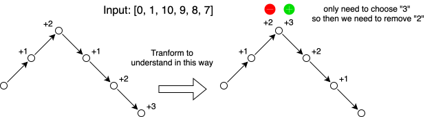

# Greedy

## **Notes**

* No pattern!

## **Typical Questions (29)**

### **Other Greedy Algos (14)**

* :orange\_circle: LC 455. Assign Cookies
  * Must do sorting first and then use 2 pointers. Otherwise, you will get **Time Limit Exceeded** (even with `Map`)
  * [Optimal Answer](https://leetcode.com/problems/assign-cookies/submissions/1748518733/). TC:  $$O(n*logn+m*logm)$$, SC: $$O(logn+logm)$$
* :white\_circle: LC 376. Wiggle Subsequence
  * I made it! Be careful for the corn case: \[0,0] and simplify the solution.
  * [Optimal Answer](https://leetcode.com/problems/wiggle-subsequence/submissions/1432016370/). TC: $$O(n)$$, SC: $$O(1)$$
* :white\_circle: LC 53. Maximum Subarray
  * Easy to miss some corner cases.
  * [Optimal Answer](https://leetcode.com/problems/maximum-subarray/submissions/1433773568/).  TC: $$O(n)$$, SC: $$O(1)$$
  * This can also be resolved by DP
* LC 122. Best Time to Buy and Sell Stock II
  * [Optimal Answer](https://leetcode.com/problems/best-time-to-buy-and-sell-stock-ii/submissions/1434601162/). TC: $$O(n)$$, SC: $$O(1)$$
  * This can also be resolved by DP
* :white\_circle: LC 55. Jump Game
  * [Optimal Answer](https://leetcode.com/problems/jump-game/submissions/1434603001/). TC: $$O(n)$$, SC:  $$O(1)$$
  * Kind of tricky in the greedy solution. Think of it in terms of coverage.
* :white\_circle: LC 45. Jump Game II
  * [Optimal Answer](https://leetcode.com/problems/jump-game-ii/submissions/1749696113/). TC:  $$O(n)$$, SC: $$O(1)$$
  * If adding early quit logic, it's easy to miss a corner case (only 1 element).
  * Kind of tricky in the greedy solution. Think of it in terms of coverage.
* :white\_circle: LC 1005. Maximize Sum Of Array After K Negations
  * Easy to miss corn cases and optimal implementation...
  * [Optimal Answer](https://leetcode.com/problems/maximize-sum-of-array-after-k-negations/submissions/1750805367/). TC: $$O(n*logn)$$, SC:  $$O(n)$$
* :orange\_circle: LC 134. Gas Station
  *   Always get stuck in the middle. I can come up with an idea that we need to do `gas[i]-cost[i]` but it's hard to know where is start index. Check the 代码随想录 video and explanation below

      > 为什么遍历到结尾就可以选择出答案呢，而且答案就是第一个遍历到结尾累加和不为0的位置，是否答案可能是该位置后面的位置呢；这就需要关注一个概念，净累加油量，既然第一个遍历到结尾的位置使得在后续所有位置都满足净累加油都大于0，那么为什么不从这第一个位置出发，而是从后续的位置出发呢，毕竟这第一个位置使得后续的所有位置的起始油量都大于0，如果选择后续任意一个位置，油量都需要从0开始，通过的可能肯定不如有油；总结就是：起始给你油你都不过，凭什么你起始油=0能过呢;
  * [Optimal Answer](https://leetcode.com/problems/gas-station/submissions/1750820347/). TC: $$O(n)$$, SC: $$O(1)$$
* :orange\_circle: LC 3397. Maximum Number of Distinct Elements After Operations
  * Got stuck in some corner cases and then checked the answer directly.
  * [Optimal Answer](https://leetcode.com/problems/maximum-number-of-distinct-elements-after-operations/submissions/1535271459). TC: $$O(n*logn)$$, SC: $$O(sorting)$$
* :white\_circle: LC 860. Lemonade Change
  * Easy to make stupid mistakes when my mind is not clear.
  * [Optimal Answer](https://leetcode.com/problems/lemonade-change/submissions/1435541748/). TC: $$O(n)$$, SC:  $$O(1)$$
* :orange\_circle: LC 738. Monotone Increasing Digits
  * ~~It's kind of impossible to come up with the correct idea and pass all tests without knowing the answer...~~ I made it after a few months (recall the solution after thinking for a while)!
  * [Optimal Answer](https://leetcode.com/problems/monotone-increasing-digits/submissions/1439538232/). TC: $$O(n)$$, SC: $$O(n)$$
* :orange\_circle: LC 968. Binary Tree Cameras
  * List all state combinations in a table to check.
  * [Optimal Answer](https://leetcode.com/problems/binary-tree-cameras/submissions/1754042870/). TC: $$O(n)$$, SC: $$O(h)$$
* :white\_circle: LC 605. Can Place Flowers
*   :red\_circle: LC 334. Increasing Triplet Subsequence

    * Using the DP solution of the longest increasing subsequence will cause TLE...
    * It's super hard to solve it within $$O(n)$$ time and $$O(1)$$ space. The answer is genius...
    * [Optimal Answer](https://leetcode.com/problems/increasing-triplet-subsequence/submissions/1463007552). TC: $$O(n)$$, SC: $$O(1)$$

    > I would like to point out that for \[1, 3, 0, 5] we will eventually arrive at big = 3 and small = 0 so big may come before small. **However, the solution still works, because big only gets updated when there exists a small that comes before it.**
* :orange\_circle: LC 680. Valid Palindrome II
  * Missing the invariant mindset. The key invariant is:
    * While `l < r` and chars match, you’re still on the “main path”.
    * The **first mismatch is the only decision point**, and it creates **two** deterministic subproblems (“is substring palindrome?”).
  * [Optimal Answer](https://leetcode.com/problems/valid-palindrome-ii/submissions/1928095211). TC: $$O(n)$$, SC: $$O(1)$$
* :white\_circle: LC 1975. Maximum Matrix Sum
  * [Optimal Answer](https://leetcode.com/problems/maximum-matrix-sum/submissions/1935267411). TC: $$O(n^2)$$, SC: $$O(1)$$
* LC 3228. Maximum Number of Operations to Move Ones to the End
  * Mind Leap
    * To maximize operations, we may think of always moving the leftmost `1` first (intuition)
    * → But the order of moves does not matter; the problem reduces to counting how many times `1`s cross `0`s
    * → Consecutive `0`s can be treated as a single zero block
    * → Each time we encounter a new zero block, all previous `1`s contribute once. Therefore, when a new zero block starts, add the number of `1`s seen so far
  * Invariant: When a new zero block starts, all previously seen `1`s contribute exactly once, and we account for it immediately.
  * [Optimal Answer](https://leetcode.com/problems/maximum-number-of-operations-to-move-ones-to-the-end/submissions/1979589119). TC: $$O(n)$$, SC: $$O(1)$$
* :orange\_circle: LC 277. Find the Celebrity
  * **Mind Leap**
    * A single comparison between two people always eliminates one of them
    * → Therefore, there is no need to maintain the full set of candidates
    * → We only need to keep track of the current survivor (`candidate`)
    * → After the scan, perform a full validation pass
  * **Invariant:** At index `i`, `candidate` is the only person in `[0..i]` who can still possibly be the celebrity
  * [Optimal Answer](https://leetcode.com/problems/find-the-celebrity/submissions/1981274409). TC: $$O(n)$$, SC: $$O(1)$$
* :white\_circle: LC 2380. Time Needed to Rearrange a Binary String
  * Mind leap
    * **Simulation of parallel swaps**
    * **→ Think in terms of each element’s completion time**
    * → Each '1' needs to cross all previous '0's (own cost)
    * → Each '1' cannot overtake the previous '1' (dependency)
    * → Completion time = max(own cost, dependency constraint)
    * → Accumulate the result in one pass
  * [Optimal Answer](https://leetcode.com/problems/time-needed-to-rearrange-a-binary-string/submissions/1983159766). TC: $$O(n)$$, SC: $$O(1)$$
* :white\_circle: LC 1665. Minimum Initial Energy to Finish Tasks
  * Approach 1: Greedy sorting + Binary Search
    * Came up with this solution by myself.
    * [Answer.](https://leetcode.com/problems/minimum-initial-energy-to-finish-tasks/submissions/2044993247) TC: $$O(nlogn)$$, SC: $$O(logn)$$
  * :thumbsup: Approach 2: Greedy sorting + Single Pass
    * [Optimal Answer](https://leetcode.com/problems/minimum-initial-energy-to-finish-tasks/submissions/2044999348). TC: $$O(nlogn)$$, SC: $$O(logn)$$
* LC 3689. Maximum Total Subarray Value I
  * [Optimal Answer](https://leetcode.com/problems/maximum-total-subarray-value-i/submissions/2096025308). TC: $$O(n)$$, SC: $$O(1)$$

### Resource Balancing

* :orange\_circle: LC 2141. Maximum Running Time of N Computers
  * Kind of tricky. The hard part is not the implementation, but realizing this is a resource balancing/leveling problem rather than a simulation problem.
  * Approach 1 using Binary Search:
    * For a target running time t, each battery can contribute at most min(battery\[i], t), so check whether sum(min(battery\[i], t)) >= (long) n \* t.
    * [Answer](https://leetcode.com/problems/maximum-running-time-of-n-computers/submissions/1965428956). TC: $$O(mlogS)$$, SC: $$O(1)$$
  * :thumbsup: Approach 2 using Greedy Leveling
    * Sort batteries. Treat the smallest m-n batteries as extra power, and the largest n batteries as the initial live batteries for n computers. Then use the extra power to level up the smaller live batteries step by step.
    * [Optimal Answer](https://leetcode.com/problems/maximum-running-time-of-n-computers/submissions/1965399422). TC: $$O(m*logm)$$, SC: $$O(logm)$$

### Kadane's Algorithm (2)

* LC 53. Maximum Subarray
  * Approach 1 with the greedy algorithm. [Answer](https://leetcode.com/problems/maximum-subarray/submissions/1749681920/). TC: $$O(n)$$, SC: $$O(1)$$
  * Approach 2 with DP. [Answer](https://leetcode.com/problems/maximum-subarray/submissions/1762014664/). TC: $$O(n)$$, SC: $$O(1)$$
* :red\_circle: LC 918. Maximum Sum Circular Subarray
  * Before solving this problem, check LC 53. Maximum Subarray first!
  * Think of it in 2 cases.&#x20;
    * Case 1: Normal Kadane's Algo result like LC 53 within single array.
    * Case 2: Result across 2 arrays.
  * Approach 1 using Kadane's Algorithm + prefixSum: [Answer](https://leetcode.com/problems/maximum-sum-circular-subarray/submissions/1869828180). TC: $$O(n)$$, SC: $$O(n)$$
  * :thumbsup: Approach 2 using Kadane's Algorithm purely: [Optimal Answer](https://leetcode.com/problems/maximum-sum-circular-subarray/submissions/1869832629). TC: $$O(n)$$, SC: $$O(1)$$
* LC 3147. Taking Maximum Energy From the Mystic Dungeon
  * [Optimal Answer](https://leetcode.com/problems/taking-maximum-energy-from-the-mystic-dungeon/submissions/1946604976). TC: $$O(n)$$, SC: $$O(1)$$

### **Split-and-Solve Dual Requirements (3)**

* LC 135. Candy
  * Approach 1 (2 arrays): If you need to compare each item of a list with its 2 neighbors, handle each side separately.
  * :orange\_circle: Approach 2 (Optimal)
    * This optimal answer is super hard to understand, and can resolve this question in SC $$O(1)$$. To understand it (I finally could make it by myself on 12/14/2025!)
      * Check this [reference](https://leetcode.com/problems/candy/solutions/2234434/c-o-n-time-o-1-space-full-explanation/?envType=company\&envId=google\&favoriteSlug=google-three-months) first.
      *

          <figure><figcaption></figcaption></figure>
    * [Optimal Answer](https://leetcode.com/problems/candy/submissions/1546958098). TC: $$O(n)$$, SC: $$O(1)$$
* :red\_circle: LC 406. Queue Reconstruction by Height
  * [Optimal Answer](https://leetcode.com/problems/queue-reconstruction-by-height/submissions/1437823506/). TC: $$O(n^2)$$, SC: $$O(n)$$
* :orange\_circle: LC 32. Longest Valid Parentheses
  * Not sure if the optimal solution to this question should be put under the greedy algo topic.
  * This problem can also be resolved by DP and Stack approaches but SC in these 2 approaches is worse than the optimal solution.
  * I came up with a [Stack solution](https://leetcode.com/problems/longest-valid-parentheses/submissions/1493676712) by myself. Although it's not as concise as the official solution in editorial, it's more understandable.
  * [Optimal Solution](https://leetcode.com/problems/longest-valid-parentheses/submissions/1493684623). TC: $$O(n)$$, SC: $$O(1)$$
* :white\_circle: LC 1717. Maximum Score From Removing Substrings
  * Key point: If you removed all `ab` from initial `s`, you will never get any `ab` while removing `ba` after that, and **vice versa**
    * When you removed all `ab` you removed ALL `a` that have `b` on the right of it.
    * Let's say we removed `ba` now and get `ab` (character `a` from the left of the `b` and character `b` on the right of the `a`, so after deleting `ba` strings concatenate into `ab`).
    * But stop, **"character `b` on the fight of the `a`"**, but didn't I tell you one point back that we deleted ALL `a` that had `b` on right? This concludes my proof; you can prove so for `ba` as well, because situations are symmetrical.
  * Approach 1 using Stack: [Answer](https://leetcode.com/problems/maximum-score-from-removing-substrings/submissions/1904822217). TC: $$O(n)$$, SC: $$O(n)$$
  * :thumbsup: Approach 2 using 2 pointers: [Optimal Answer](https://leetcode.com/problems/maximum-score-from-removing-substrings/submissions/1904828436). TC: $$O(n)$$, SC: $$O(n)$$

### **Range/Interval Problem (10)**

* Notes
  * Be careful about the **LAST** interval/range during processing. It's easy to miss that!
  * See trigger page
* :white\_circle: LC 452. Minimum Number of Arrows to Burst Balloons
  * Try not to modify the input array.
  * [Optimal Answer](https://leetcode.com/problems/minimum-number-of-arrows-to-burst-balloons/submissions/1753012795). TC: $$O(n*logn)$$, SC: $$O(logn)$$
* :white\_circle: LC 435. Non-overlapping Intervals
  * [Optimal Answer](https://leetcode.com/problems/non-overlapping-intervals/submissions/1472215888/). TC: $$O(n*logn)$$, SC: $$O(logn)$$
* :orange\_circle: LC 763. Partition Labels
  * I made it!
  * [Optimal Answer](https://leetcode.com/problems/partition-labels/submissions/1438735735/). TC: $$O(n)$$, SC: $$O(1)$$
* :white\_circle: LC 56. Merge Intervals
  * Try to do it without modifying the original input arrays during `for` loop!
  * [Optimal Answer](https://leetcode.com/problems/merge-intervals/submissions/1170982897). TC: $$O(n*log{n})$$, SC: $$O(log{n})$$
* LC 3394. Check if Grid can be Cut into Sections
  * [Optimal Answer](https://leetcode.com/problems/check-if-grid-can-be-cut-into-sections/submissions/1540085152). TC: $$O(n*log{n})$$, SC: $$O(sorting)$$
* :white\_circle: LC 57. Insert Interval
  * It's easy to miss the clearest approach and end up in a convoluted line of thought.
  * Resolve it step by step based on different sections of the intervals array.
  * [Optimal Answer](https://leetcode.com/problems/insert-interval/submissions/1495784276). TC: $$O(n)$$, SC: $$O(1)$$
* LC 252. Meeting Rooms
  * [Optimal Answer](https://leetcode.com/problems/meeting-rooms/submissions). TC: $$O(n*log{n})$$, SC: $$O(n)$$
* :orange\_circle: LC 3439. Reschedule Meetings for Maximum Free Time I
  * Although I came up with a solution after thinking about it for a long time, I made the problem too complicated. The core point is how to construct the `gaps` array correctly: **When there are N non-overlapping meetings, there will be N+1 gaps (some of which may have a duration of 0)**.
  * [Optimal Answer](https://leetcode.com/problems/reschedule-meetings-for-maximum-free-time-i/submissions/1536362972). TC: $$O(n)$$, SC: $$O(n)$$
* :white\_circle: LC 3440. Reschedule Meetings for Maximum Free Time II
  * I put this problem here because LC 3439 is listed above, but not sure if "Greedy" is the best section for this problem
  * I got the core idea and came up with a solution with TC $$O(n*log{n})$$ but `TreeMap` can be further optimized to 2 arrays: `leftMaxArray`  and `rightMaxArray`
  * [Optimal Answer](https://leetcode.com/problems/reschedule-meetings-for-maximum-free-time-ii/submissions/1543365975). TC: $$O(n)$$, SC: $$O(n)$$
* :white\_circle: LC 228. Summary Ranges
  * [Optimal Answer](https://leetcode.com/problems/summary-ranges/submissions/1786805996). TC: $$O(n)$$, SC: $$O(1)$$
* :orange\_circle: LC 2054. Two Best Non-Overlapping Events
  * I came up with the final solution by myself, but this is after 2 failed attempts and took around 40 minutes in total, including all attempts.
  * [Optimal Answer](https://leetcode.com/problems/two-best-non-overlapping-events/submissions/1974842292). TC: $$O(n*logn)$$, SC: $$O(n)$$
* :orange\_circle: LC 757. Set Intersection Size At Least Two
  * [Optimal Answer](https://leetcode.com/problems/set-intersection-size-at-least-two/submissions/1985823936). TC: $$O(nlogn)$$, SC: $$O(logn)$$

### Classification Discussion

* :orange\_circle: LC 3633. Earliest Finish Time for Land and Water Rides I
  * [Optimal Answer](https://leetcode.com/problems/earliest-finish-time-for-land-and-water-rides-i/submissions/2112171898). TC: $$O(m+n)$$, SC: $$O(1)$$
